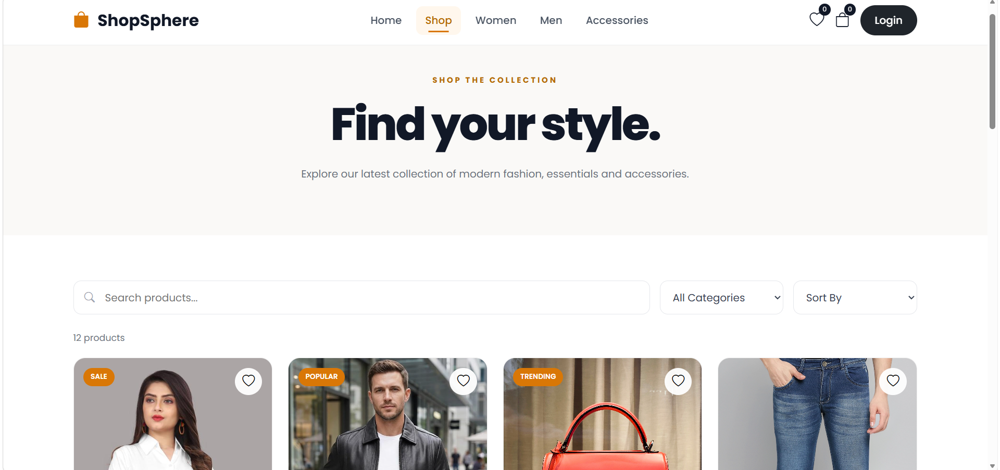
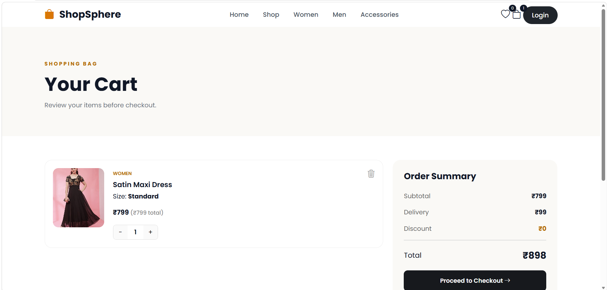
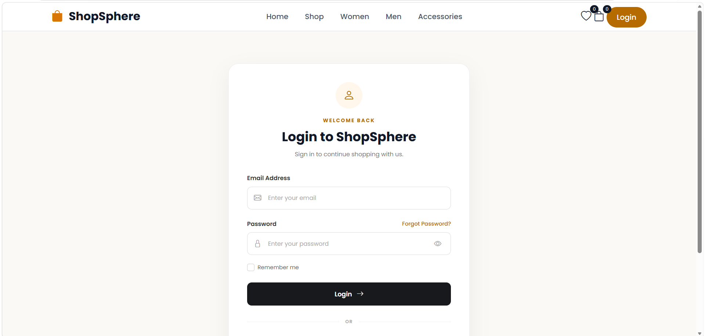

# 🛍️ ShopSphere

> A responsive e-commerce frontend website built with HTML, CSS, and JavaScript.

[](https://developer.mozilla.org/en-US/docs/Web/HTML)
[](https://developer.mozilla.org/en-US/docs/Web/CSS)
[](https://developer.mozilla.org/en-US/docs/Web/JavaScript)
[](https://github.com/)

## 🌐 Live Demo

**Live Demo:** Add your GitHub Pages link here after deployment.

## 📸 Screenshots

### 🏠 Home Page


### 🛍️ Products Page



### 🛒 Shopping Cart



### 👤 User Authentication



## ✨ Features

| Feature                   | Description                                           |
| ------------------------- | ----------------------------------------------------- |
| 🏠 Home Page              | E-commerce landing page with product-focused sections |
| 🛍️ Product Browsing      | Displays products with dedicated product pages        |
| 🔎 Product Details        | Individual product information and interactions       |
| 🛒 Shopping Cart          | Cart interface for managing selected products         |
| ❤️ Wishlist               | Interface for managing favourite products             |
| 🔐 Authentication         | Login and signup interfaces                           |
| 👤 User Profile           | Profile management interface                          |
| 💳 Checkout               | Checkout and order-success pages                      |
| 📱 Responsive UI          | Designed for different screen sizes                   |
| ⚡ JavaScript Interactions | Client-side interactions and dynamic functionality    |
| ❌ 404 Page                | Custom error page for invalid routes                  |

## 🛠️ Tech Stack

* **HTML5** — Page structure and semantic markup
* **CSS3** — Styling, layouts, and responsive design
* **JavaScript** — Interactive functionality and client-side logic
* **Git & GitHub** — Version control and project hosting

## 📂 Project Structure

```text
ShopSphere/
│
├── index.html
├── products.html
├── product-details.html
├── cart.html
├── checkout.html
├── login.html
├── signup.html
├── profile.html
├── wishlist.html
├── order-success.html
├── 404.html
│
├── *.css
├── *.js
├── *.jpg
│
├── .gitignore
└── README.md
```

## 🚀 Getting Started

### 1. Clone the repository

```bash
git clone https://github.com/Priyu-code14/ShopSphere.git
```

### 2. Open the project

```bash
cd ShopSphere
```

### 3. Run the website

Open `index.html` in your browser.

No backend or additional installation is required.

## 🎯 Project Objective

ShopSphere was developed to practice building a complete multi-page e-commerce frontend using HTML, CSS, and JavaScript.

The project focuses on responsive layouts, structured page navigation, reusable styling, client-side interactions, and creating a realistic e-commerce user experience.

## 🔮 Future Improvements

* Add a backend and database
* Implement real user authentication
* Add product search and advanced filtering
* Connect products to a REST API
* Add payment gateway integration
* Add an admin dashboard
* Deploy the application with a live backend

## 👩‍💻 Developer

**Priya Dharshini**

GitHub: [Priyu-code14](https://github.com/Priyu-code14)
